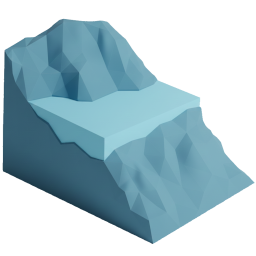
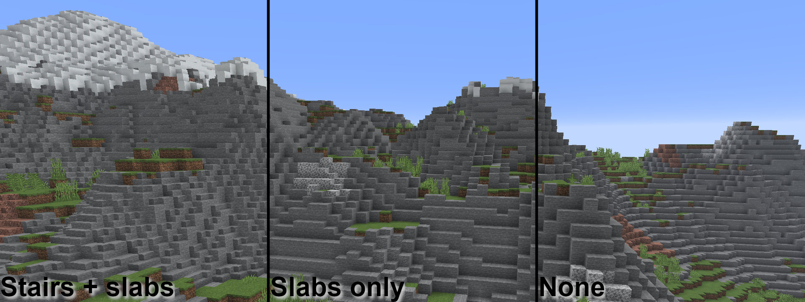
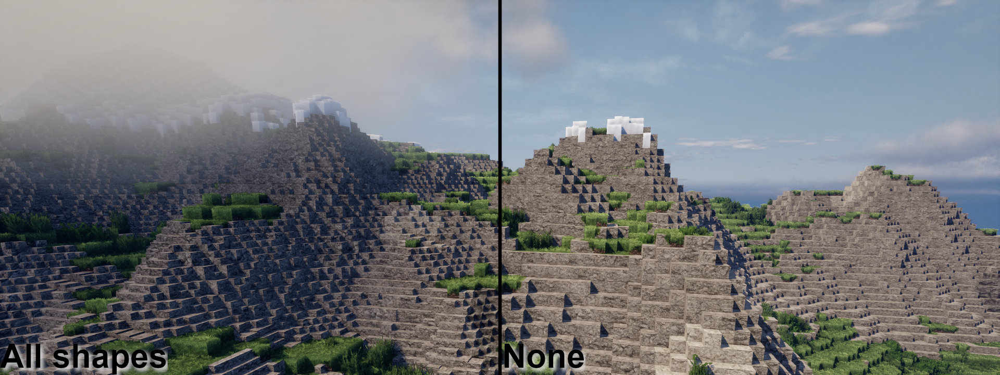
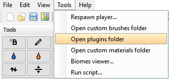
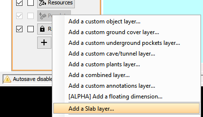
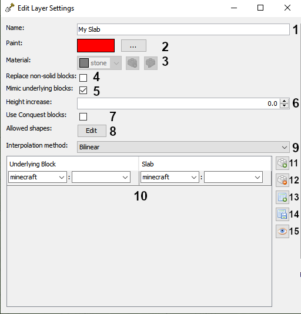
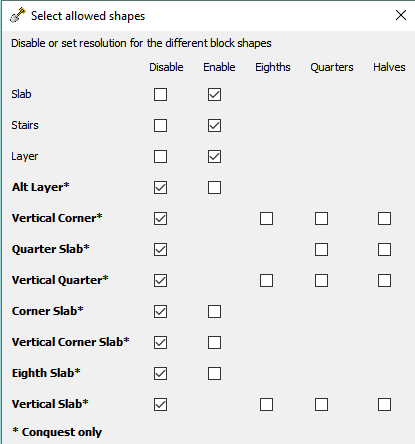

<h1>
  
  Slabify
</h1>

This is a _WorldPainter_ plugin designed to add slab and stair detail to terrain and increase
the effective resolution of the terrain. **Current version: 1.0.1 (Snapshot 2)**

<h2>
  
  Possibilities
</h2>

Currently, the following is supported:

* Automatic stair and slab placement on terrain
* Support for _Conquest Reforged_ shapes such as vertical slabs
* Bicubic and bilinear interpolation to upscale the internal heightmap

<h2>
  
  Samples
</h2>

<h2>
  
  Installation and usage
</h2>

Place the `SlabifyPlugin-X.X.X.jar` into the _WorldPainter_ `plugins` folder. On Windows, this would be
`%AppData%/Roaming/WorldPainter/plugins`. Alternatively, you can click on "Open plugins folder" in the
_WorldPainter_ toolbar.

Creating a slab layer is done in a similar manner to a custom object layer.

| Number | Name                     | Description                                                                                                                                                                                                                                                                                                                                                                                                                                                       |
|--------|--------------------------|-------------------------------------------------------------------------------------------------------------------------------------------------------------------------------------------------------------------------------------------------------------------------------------------------------------------------------------------------------------------------------------------------------------------------------------------------------------------|
| 1      | Name                     | The name of the layer.                                                                                                                                                                                                                                                                                                                                                                                                            |
| 2      | Paint                    | The color of the layer.                                                                                                                                                                                                                                                                                                                                                                                                         |
| 3      | Material                 | The material of the slab. This is not used if **Option 5** is selected. The blocks must be full blocks. For example, `minecraft:stone` is correct, but `minecraft:stone_slab` will result in an error.                                                                                                                                                                                                                                                            |
| 4      | Replace non-solid blocks | Select this option to ensure slabs and other shapes will replace non-solid blocks like grass.                                                                                                                                                                                                                                                                                                                                                                     |
| 5      | Mimic underlying blocks  | Select this option to enable **Options 10 to 15**.                                                                                                                                                                                                                                                                                                                                                                                                                |
| 6      | Height increase          | The amount to increase the height by. Allowable values range from 0 to 1.5. Setting this value to 0 will result in both the removal and addition of blocks to the terrain. Setting this value to 0.5 will result in (typically) only the addition of blocks to the terrain. For reference, the _WorldPainter_ frost layer increases the terrain height by 0.5.                                                                                                    |
| 7      | Use Conquest blocks      | Select this option to allow blocks from the `conquest` namespace. This option must be selected to enable the additional Conquest shapes.                                                                                                                                                                                                                                                                                                                          |
| 8      | Allowed shapes           | Click this button to open a dialog to select the shapes to use (e.g., stairs and slabs).                                                                                                                                                                                                                                                                                                                                                                          |
| 9      | Interpolation method     | The interpolation method to use to inform slab and shape placement. Bilinear is faster and bicubic is slower. However, bicubic interpolation results in sharper images and may result in better-looking terrain in certain applications.                                                                                                                                                                                                                          |
| 10     | "Mimic" table            | This table will only be active if **Option 5** is selected. This allows the placement of a certain slab material on top of a terrain material. For instance, if the underlying block is `minecraft:stone` and the slab block is `minecraft:diorite`, diorite slabs and stairs will be placed on top stone blocks whereever needed. Like **Option 3**, the slab block _must_ be a full block. `minecraft:diorite` is correct, but `minecraft:diorite_slab` is not! |
| 11     | Add table entry          | Add an extra row to the table.                                                                                                                                                                                                                                                                                                                                                                                                                                    |
| 12     | Remove table entry       | Remove the last row of the table.                                                                                                                                                                                                                                                                                                                                                                                                                                 |
| 13     | Load configuration       | Load a previous table configuration from file.                                                                                                                                                                                                                                                                                                                                                                                                                    |
| 14     | Save configuration       | Save the current table configuration to file.                                                                                                                                                                                                                                                                                                                                                                                                                     |
| 15     | Visualizer               | Visualize how the slabs/stairs would look on the underlying block.                                                                                                                                                                                                                                                                                                                                                                                                |

All the shapes should be self-explanatory. Note that in Vanilla Minecraft, the shape is only available for
`minecraft:snow_block` (as snow layers). No issues will arise if a shape that is not available is selected.

**Advanced**: After running the plugin at least once, there should be a file `%AppData%/Roaming/WorldPainter/mapping.csv`.
This file links together blocks and their slab and stair (and Conquest shape) variants. The first column represents
the block to be entered and the remaining columns represent the variants connected to that block. If you
are unsure which block to enter to get a certain slab material, this file is your guide. While you can also
add your own rows to this file, it is comprehensive for both Vanilla Minecraft and Conquest Reforged.

<h2>
  
  Note
</h2>

**This plugin is still under development.** If a bug occurs, please contact me through Discord or create an issue.
Files with layers created by older versions will be backwards compatible with newer versions unless noted
otherwise. As my time is limited, contributions are highly welcome!

<h2>
  
  Distributing
</h2>

Slabify is _open source_ software, licensed under the GPL version 3. This means that if you distribute it, original or in modified form, you must also distribute it (including your changes) as open source under the GPL version 3 (or later). See the [LICENSE](LICENSE) file for details.